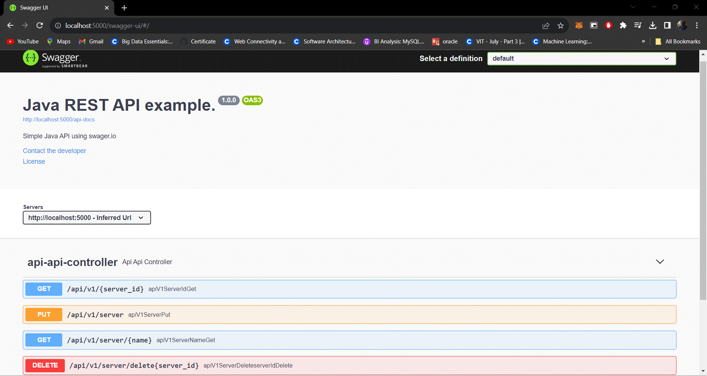

# Task 2. Swagger codegen.
# Swagger generated server

Spring Boot Server 


## Overview  
This server was generated by the [swagger-codegen](https://github.com/swagger-api/swagger-codegen) project.  
By using the [OpenAPI-Spec](https://github.com/swagger-api/swagger-core), you can easily generate a server stub.  
This is an example of building a swagger-enabled server in Java using the SpringBoot framework.

The underlying library integrating swagger to SpringBoot is [springdoc-openapi](https://github.com/springdoc/springdoc-openapi)

Start your server as an simple java application  

You can view the api documentation in swagger-ui by pointing to  
http://localhost:8080/  

Change default port value in application.properties



## OpenAPI code
```yaml
openapi: 3.0.0
info:
  title: Java REST API example.
  description: Simple Java API using swager.io
  version: 1.0.0
  contact:
    email: urahulprasad23@gmail.com
    
paths:
  /api/v1/{server_id}:
    get:
      description: use this api to fetch the server using id
      parameters:
        - name: server_id
          required: true
          in: path
          schema:
            type: string
      responses:
        "200":
          description: course created successfully
          content:
            application/json:
              schema:
                $ref: "#/components/schemas/serverData"
        '404':
          description: User ID not found
  /api/v1/server:
    put:
      description: Use this API to create server
      requestBody:
        description: Structure of a server
        required: true
        content:
          application/json:
            schema:
              $ref: '#/components/schemas/serverData'
      responses:
        "200":
          description: course created successfully
  /api/v1/server/{name}:
    get:
      description: use this api to fetch the server using name
      parameters:
        - name: name
          required: true
          in: path
          schema:
            type: string
      responses:
        "200":
          description: course created successfully
          content:
            application/json:
              schema:
                $ref: "#/components/schemas/serverData"
        '404':
          description: User ID not found
  /api/v1/server/delete{server_id}:
    delete:
      description: use this api to fetch the server using name
      parameters:
        - name: server_id
          required: true
          in: path
          schema:
            type: string
      responses:
        "200":
          description: deleted successfully
        "404":
          description: used id not found
          
      
components:
  schemas:
    serverData:
      type: object
      properties:
        id:
          type: string
        name:
          type: string
        language:
          type: string
        framework:
          type: string
```
